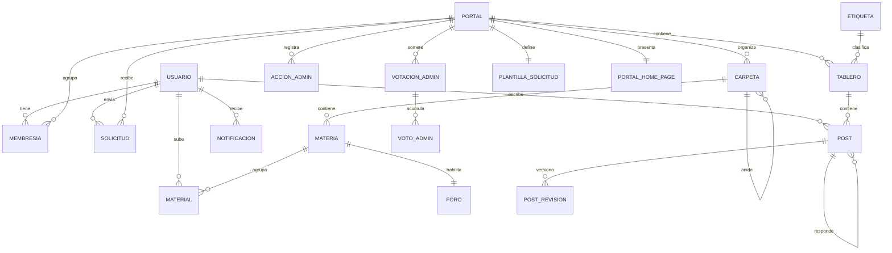

<div align="center">

# Scholarium

**Plataforma web de portales académicos universitarios**

Estudiantes crean y administran portales propios por universidad y carrera para
compartir material de estudio, organizarlo por materias y debatir en foros, con
moderación, control de acceso por rol y herramientas administrativas.


**[Ver demo en vivo](PENDIENTE_URL)**

</div>

---

## Capturas

<!--
  PENDIENTE: reemplazar por capturas reales.
  Sugerencia de 4: home de un portal, estructura de carpetas y materias,
  un hilo del foro, y el panel de administración.
  Guardalas en /docs/screenshots/ y referencialas así:

  | Portal | Foro |
  |---|---|
  |  |  |
-->

---

## Qué hace

Cada carrera de cada universidad tiene un único portal, administrado por los
propios estudiantes. Dentro de un portal:

- **Material académico** organizado en un árbol de carpetas y materias, con
  subida de archivos y moderación previa a la publicación.
- **Foros** por materia y un foro general del portal, con hilos anidados,
  edición con historial de revisiones y ocultamiento moderado.
- **Membresías y solicitudes de ingreso**, con plantillas de requisitos
  configurables por portal y portales abiertos o cerrados.
- **Administración distribuida**: los administradores del portal aprueban
  material, gestionan miembros, bloquean usuarios y editan la página de
  inicio mediante un editor por bloques.
- **Votación entre administradores** para las acciones más sensibles, de modo
  que ningún admin pueda cambiar unilateralmente el estado del portal.
- **Notificaciones** generadas por eventos de dominio (solicitud aprobada,
  material moderado, ascenso a administrador, etc.).

---

## Decisiones técnicas

Las partes del proyecto que resultaron más interesantes de resolver:

**Hilos de foro con CTEs recursivas.** Los posts se anidan a profundidad
arbitraria. En lugar de traer el árbol completo a memoria y armarlo en la
aplicación, la jerarquía se resuelve en PostgreSQL con `WITH RECURSIVE`, lo que
permite paginar y filtrar sobre el árbol sin cargarlo entero.

**Autenticación con JWT y refresh tokens.** La API es *stateless*. El cliente
mantiene un access token de corta duración y uno de refresco; toda la lógica de
renovación está centralizada en un interceptor HTTP, de modo que ningún
componente de la interfaz tiene que saber que el token expiró.

**Votación administrativa con quórum.** Ciertas acciones —cambiar el tipo de
acceso del portal, modificar universidad o carrera, archivarlo— no las ejecuta
un administrador solo: abren una votación entre los administradores del portal
y se aplican al alcanzarse el quórum. Cada acción queda asentada en un registro
de auditoría.

**Borrado lógico transversal.** Ninguna entidad de dominio se elimina
físicamente. El modelo usa banderas de actividad, lo que preserva la integridad
referencial de foros, materiales y auditoría cuando un usuario deja un portal.

**Notificaciones desacopladas por eventos.** Los servicios publican eventos de
dominio y un listener anotado con `@TransactionalEventListener` los consume
dentro de la transacción, evitando que la lógica de notificación se mezcle con
la de negocio.

**Almacenamiento de archivos delegado.** Los materiales y las imágenes de
portales se suben a Cloudinary; la base guarda la URL, el nombre original, el
tamaño y el tipo MIME.

---

## Stack

### Backend

| | |
|---|---|
| Lenguaje | Kotlin, sobre JDK 21 |
| Framework | Spring Boot 3.3.1 |
| Seguridad | Spring Security + JWT · Google OAuth 2.0 |
| Persistencia | Spring Data JPA + Hibernate 6.5 |
| Base de datos | PostgreSQL 18 |
| Almacenamiento | Cloudinary |
| Mail | SMTP (recuperación de contraseña) |
| Build | Gradle (Kotlin DSL) |

### Frontend

| | |
|---|---|
| Framework | React 19 |
| Lenguaje | TypeScript |
| Build | Vite |
| Estilos | Tailwind CSS v4 |
| HTTP | Axios, con interceptores de autenticación |
| Ruteo | React Router |

---

## Modelo de datos



<!--
  NOTA: verificar este diagrama contra el modelo real antes de publicar.
  Está simplificado a propósito: omite columnas y algunas relaciones
  secundarias para que se lea de un vistazo.
-->

---

## Cómo levantarlo

### Requisitos

- JDK 21
- Node.js 20 o superior
- Docker y Docker Compose

### 1. Base de datos

Desde la raíz del repositorio:

```bash
docker compose up -d
```

Levanta PostgreSQL 18 en el puerto **5433** y pgAdmin en el **5051**.

### 2. Backend

Creá un archivo `.env` en la raíz del repositorio:

```bash
# Seguridad
JWT_SECRET=una_clave_aleatoria_de_al_menos_256_bits

# Cloudinary — https://cloudinary.com/console
CLOUDINARY_CLOUD_NAME=tu_cloud_name
CLOUDINARY_API_KEY=tu_api_key
CLOUDINARY_API_SECRET=tu_api_secret

# Envío de mails (recuperación de contraseña)
MAIL_USERNAME=tu_cuenta@gmail.com
MAIL_PASSWORD=tu_app_password

# Google OAuth — https://console.cloud.google.com
GOOGLE_CLIENT_ID=tu_client_id.apps.googleusercontent.com
```

Y levantá el servidor:

```bash
cd backend
./gradlew bootRun
```

Queda escuchando en `http://localhost:9001`.

En el perfil por defecto, un *seeder* puebla la base con datos de ejemplo la
primera vez que arranca contra una base vacía.

### 3. Frontend

Creá `frontend/.env`:

```bash
VITE_API_URL=http://localhost:9001
VITE_GOOGLE_CLIENT_ID=tu_client_id.apps.googleusercontent.com
```

Y levantalo:

```bash
cd frontend
npm install
npm run dev
```

Disponible en `http://localhost:5173`.

---

## Configuración por perfiles

| | Perfil por defecto | Perfil `prod` |
|---|---|---|
| Esquema | `ddl-auto: update` | `ddl-auto: validate` |
| SQL en logs | Sí | No |
| Datos de ejemplo | Sí | No |
| Mensajes de error al cliente | Completos | Genéricos |

El perfil de producción se activa con `SPRING_PROFILES_ACTIVE=prod` y espera
además `DATABASE_URL`, `DB_USERNAME`, `DB_PASSWORD` y `CORS_ORIGINS`.

---

## Estructura

```
.
├── backend/
│   └── src/main/kotlin/com/unsam/scholarium/
│       ├── bootstrap/    # datos de ejemplo para desarrollo
│       ├── config/       # seguridad, CORS, Cloudinary
│       ├── controller/   # endpoints REST
│       ├── dto/          # contratos de entrada y salida
│       ├── exception/    # excepciones de dominio
│       ├── listener/     # notificaciones por eventos
│       ├── mapper/       # entidad ↔ DTO
│       ├── model/        # entidades JPA
│       ├── repository/   # Spring Data
│       └── service/      # lógica de negocio
├── frontend/
│   └── src/main/
│       ├── Components/   # componentes reutilizables
│       ├── Layouts/      # estructuras de página
│       ├── Pages/        # vistas por sección
│       ├── hooks/        # lógica compartida
│       ├── services/     # cliente HTTP por dominio
│       └── types/        # tipos del contrato con la API
└── docker-compose.yml
```

---

## Contexto

Trabajo final de la materia **Proyecto de Software** de la Tecnicatura
Universitaria en Programación Informática de la **UNSAM**.

Desarrollado por un equipo de 5 personas a lo largo de 6 sprints, con revisiones
quincenales. 
