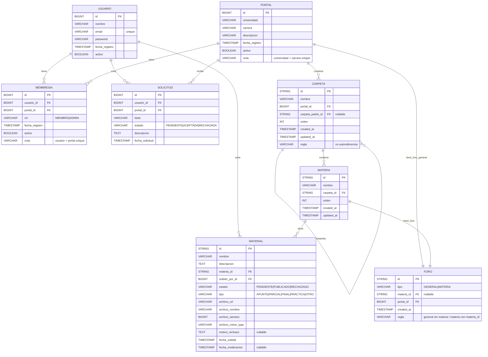

# TP-Proyecto-Scholarium (o Scholaria? Podemos ver nombres)
Repositorio del trabajo final de la materia Proyecto de Software, último cuatrimestre de la Tecnicatura en Programación Informática en la UNSAM.

## Portal Universitario Colaborativo

Plataforma colaborativa para crear portales de carreras universitarias gestionados por estudiantes. Cada carrera dentro de una universidad tiene un único portal donde se organiza información académica, materias y material de estudio, además de contar con espacios de discusión.

---

## 🛠️ Stack Tecnológico

### Backend
- **Lenguaje:** Kotlin
- **Framework:** Spring Boot 3.x
- **Persistencia:** Spring Data JPA + Hibernate
- **Base de datos:** PostgreSQL
- **Autenticación:** Spring Security + JWT
- **Build tool:** Gradle

### Frontend
- **Framework:** React 18+
- **Lenguaje:** TypeScript
- **Build tool:** Vite
- **Estilos:** Tailwind CSS
- **HTTP Client:** Axios
- **Routing:** React Router v6

### Arquitectura
- **Patrón:** Arquitectura en capas (Controller → Service → Repository)
- **API:** REST
- **Autenticación:** JWT (JSON Web Tokens) stateless

### Storage
- **Archivos:** [AWS S3 / Almacenamiento local]* 
  *(Se definirá en el Sprint 2)*

---

## 📋 Requisitos Previos

### Backend
- JDK 17 o superior
- PostgreSQL 15+
- Gradle 8+ (o usar el wrapper incluido)

### Frontend
- Node.js 18+ 
- npm o yarn

---

## 🚀 Instalación y Ejecución

### Backend

1. Clonar el repositorio:
```bash
git clone https://github.com/[tu-usuario]/[nombre-repo].git
cd [nombre-repo]/backend
```

2. Configurar PostgreSQL:
```sql
CREATE DATABASE portal_universitario;
CREATE USER portal_user WITH PASSWORD 'tu_password';
GRANT ALL PRIVILEGES ON DATABASE portal_universitario TO portal_user;
```

3. Configurar `application.properties`:
```properties
spring.datasource.url=jdbc:postgresql://localhost:5432/portal_universitario
spring.datasource.username=portal_user
spring.datasource.password=tu_password
spring.jpa.hibernate.ddl-auto=update
```

4. Ejecutar la aplicación:
```bash
./gradlew bootRun
```

El backend estará disponible en `http://localhost:8080`

---

### Frontend

1. Navegar al directorio del frontend:
```bash
cd frontend
```

2. Instalar dependencias:
```bash
npm install
```

3. Configurar variables de entorno (crear archivo `.env`):

---


---

## Cómo usar Insomnia (o cualquier otra app, ej: Postman, Bruno, etc) 

- Van a Claude, ChatGPT, etc y les pasan los controllers actualizados. En base a eso, piden que "en base a esos Endpoints, genere las peticiones HTTP para probar en el programa." Seguramente devuelve un archivo cURL para importar, o algo del estilo. Por ejemplo, Claude me devolvió la colección entera en un formato especifico (creo que era un archivo que se copió a mi portapapeles, algo tipo json), y eso lo importé en Insomnia:
  
  

  Así, tengo ya la colección para probar los endpoints que vayamos agregando:
  
  
  
  

- Ahora, también hay que tomar en cuenta la enorme ventaja de las variables de entorno. Esto es útil por varios motivos (no solo útil, sino que hacerlo de forma manual haría el trabajo muy engorroso y mucho más lento).

  Primero, por el token JWT:

  

  Luego, por todos los IDs y UUIDs que podríamos llegar a mandar en las requests (como se ve, aparte de base_url):

  

  ¿Dónde están estas variables?

  
  
  

 Seguramente, como me pasó a mí, van a tener muchas dudas y problemas para usar Insomnia al principio, pero van preguntando a la IA que más bien les caiga y así van a irse acostumbrando.
